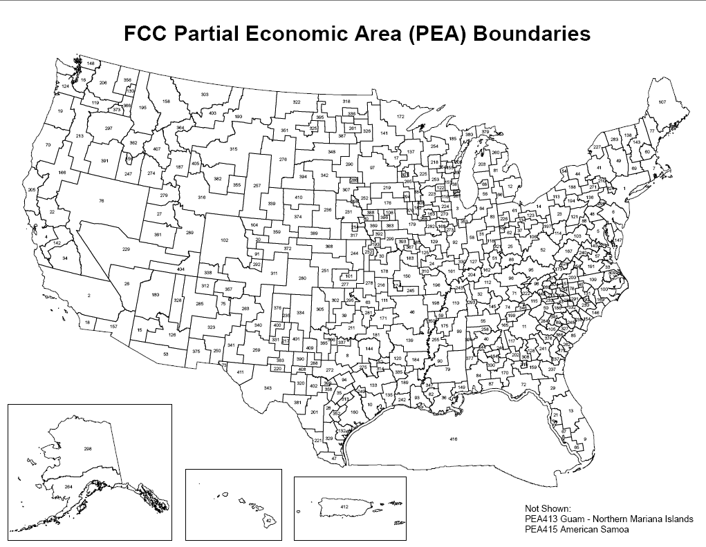

## Pattern

A map that illustrates areas that would be included in a federal spectrum auction.

`<iframe width="700" height="600" allow="local-network-access; geolocation" title="Upper C-Band Proposed Tribal Land Eligibility" src="https://ilsr.maps.arcgis.com/apps/mapviewer/index.html?configurableview=true&amp;webmap=eb66451254e442f0bf99c883a6c49ab6&amp;theme=light&amp;heading=true&amp;legend=true&amp;scroll=false&amp;center=-111.35708721794742,52.44522034225064&amp;scale=73957190.9489445"`{=html}

</iframe>

The layers illustrating differences between the proposed and restrictive definitions of eligibility are based on the calculation of population within Tribal areas within a given PEA (for each definition of Tribal eligibility).

## Request

A map that shows Tribal areas that may be included in a Federal Communication Commission (FCC) auction of upper c-band spectrum. It also needed to show Tribal areas that would be eligible based on a prior definition of eligibility for a Tribal priority window and Tribal areas that would be eligible based on a more expansive definition of eligibility. The overall goal of the map was to demonstrate that the more expansive definition of Tribal eligibility would enable more Tribes to participate and/or expand where Tribes could participate, but is a minor change to make.

## Data Used

::::: grid
::: g-col-4
**Partial Economic Areas:** subdivisions of EAs based on the Cellular Market Area[^1] boundaries; they are smaller than EAs[^2] and they separate rural from urban markets to a greater degree than EAs[^3]. Not all PEAs shown in this map had spectrum available to be licensed in the auction.
:::

::: g-col-8
[{fig-alt="Map of partial economic area boundaries across the United States." fig-align="right"}](https://www.fcc.gov/oet/maps/areas)
:::
:::::

[^1]: CMAs are standard geographic areas used for licensing cellular systems; they consist of Metropolitan Statistical Areas (MSAs) (defined by OMB) and Rural Service Areas (RSAs) (defined by the FCC).

[^2]: As defined by the Bureau of Economic Analysis, EAs are “one or more economic nodes – metropolitan areas or similar areas that serve as centers of economic activity – and the surrounding counties that are economically related to the nodes”. EAs can be aggregated to form larger areas, such as Major Economic Areas (MEAs) and Regional Economic Area Groupings (REAGs).

[^3]: Definitions of PEA, EA, and CMA from [this page.](https://www.commlawblog.com/2013/12/articles/broadcast/incentive-auction-update-add-pea-to-the-alphabet-soup-options-for-the-600-mhz-band/)

[Rural Tribal Window Applications (Pending and Accepted for Filing)](https://fcc.maps.arcgis.com/apps/webappviewer/index.html?id=b51c97987df5452da4a2b37ec6c28d09) - More specifically, the layer [Eligible Tribal Lands](https://services.arcgis.com/YnOQrIGdN9JGtBh4/ArcGIS/rest/services/eligible_tribal_lands/FeatureServer/0) was used to illustrate the more restrictive definition of Tribal eligibility.

The [American Indian, Alaska Native, and Native Hawaiin Areas geography](https://www.arcgis.com/home/item.html?id=70c973c7e48949f9845e320f3b79a1d7) was used to illustrate the more expansive definition of Tribal eligibility. This layer was filtered to remove areas of CLASSFP types 'D4[^4]' and 'D9[^5]'.

[^4]: Legal state recognized American Indian area.

[^5]: Statistical American Indian area defined for a state-recognized tribe that does not have a reservation or off-reservation trust land, specifically a state-designated tribal statistical area.

## Finding

The difference (measured in population) between the proposed geographic eligibility for Tribes vs. the more restrictive definition is pretty minimal (\<1%).
