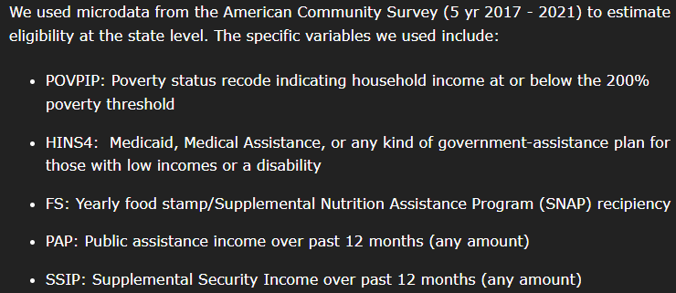

## Pattern

::::: grid
::: g-col-6
Interactive dashboard that displays data about enrollment and expenditures, across multiple geography types, for a federal subsidy program.
:::

::: g-col-6
[{fig-alt="This dashboard displays enrollment and expenditure data across states, congressional districts, and zip codes in interactive maps. It also includes several single-statistic elements, including: 23 of 53 million households were enrolled in the program, of those that were eligible; 44 percent of households were eligible, nationwide; a regression model displayed in a line chart shows that we predicted the program funds would be depleted by by late May-early June of 2024; as of April 2024, $715 million dollars were spent each month; 55.9% used the subsidy for mobile Internet, 43.2% used the subsidy for fixed Internet, and .9% used the subsidy for wireless or satellite-based Internet." fig-align="center"}](https://acpdashboard.com/)
:::
:::::

## Request

A dashboard that shows [Affordable Connectivity Program](https://www.usac.org/about/affordable-connectivity-program/) enrollment rates across the country, and some different statistics about how much money is being spent, how much is left, and when we expect the program funds to run out.

## Data Used

::::: grid
::: g-col-6
All data about enrollment and reimbursement claims (expenditures) from ISPs were collected regularly from the [ACP Enrollment and Claims Tracker](https://www.usac.org/about/affordable-connectivity-program/acp-enrollment-and-claims-tracker/), managed and hosted by the [Universal Service Administrative Co.](https://www.usac.org/about/) This webpage included an ongoing list of how much of the fund had been spent and how many were enrolled per state, along with various spreadsheets describing enrollment and reimbursement claims. These files were organized by geography type (state, county, and zip code), but some of these files were updated only monthly, while others were updated more frequently. This webpage also included general descriptions of household eligibility for ACP, and we used these to create estimates of household eligibility at the state, congressional district, and zip code level. The data used to calculate these estimates came from the Census Bureau's 5-year [American Community Survey](https://www.census.gov/programs-surveys/acs/about.html) data tables, along with the [U.S. Federal Poverty Guidelines](https://aspe.hhs.gov/topics/poverty-economic-mobility/poverty-guidelines). \
\
The ACP data were downloaded and regularly compiled into a spreadsheet, which was used to generate the maps and graphics displayed in the Tableau dashboard. The dashboard was created using Tableau Desktop, and is hosted on Tableau Public.
:::

::: g-col-6
[{fig-alt="Image shows a screenshot of the text, \"We used microdata from the American Community Survey (5 yr 2017 - 2021) to estimate eligibility at the state level. The specific variables we used include: POVPIP: Poverty status recode indicating household income at or below the 200% poverty threshold; HINS4: Medicaid, Medical Assistance, or any kind of government-assistance plan for those with low incomes or a disability; FS: Yearly food stamp/Supplemental Nutrition Assistance Program (SNAP) recipiency; PAP: Public assistance income over past 12 months (any amount); SSIP: Supplemental Security Income over past 12 months (any amount)"}](https://github.com/Institute-for-Local-Self-Reliance/Affordable-Connectivity-Program-Analysis/blob/main/README.md)
:::
:::::

## Finding

[Our early prediction](https://communitynetworks.org/content/new-resource-tracking-affordable-connectivity-program) that program funds would run out in early 2024 played out as expected, and unfortunately Congress did not allocate additional funds. Following an enrollment freeze in February of 2024, we discontinued updates to the dashboard as of April 2024. At that point in time, 23 million households were enrolled in the program, and 23 million households would see \$30 added back to their Internet bill (or \$75 if they lived on Tribal lands).

The dashboard itself was (and continues to be) quite successful as an advocacy tool. It was used by groups working on-the-ground to help target where more effort was needed to teach folks about the program and help them get enrolled. It's also been referenced in Senate hearings and by other groups in their effort to advocate for more affordable Internet access.

```{=html}
<div id="dashboard-wrapper" style="width: 100%; overflow: hidden; position: relative;">
  <div id="dashboard-scaler" style="width: 1500px; height: 1700px; transform-origin: top left;">
    <iframe 
      src="https://acpdashboard.com/" 
      title="The ACP Dashboard"
      allow="local-network-access; geolocation"
      width="1500" 
      height="1700" 
      style="border: 0;">
    </iframe>
  </div>
</div>

<script>
  function scaleDashboard() {
    const wrapper = document.getElementById('dashboard-wrapper');
    const scaler = document.getElementById('dashboard-scaler');
    const scale = wrapper.offsetWidth / 1500;
    scaler.style.transform = `scale(${scale})`;
    wrapper.style.height = (1700 * scale) + 'px';
  }
  window.addEventListener('resize', scaleDashboard);
  window.addEventListener('load', scaleDashboard);
</script>
```
