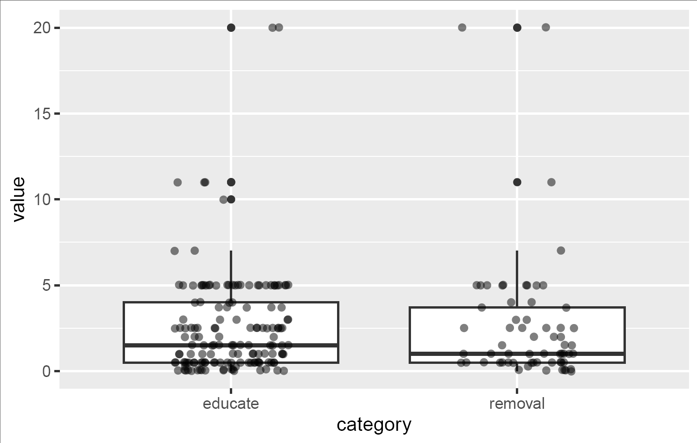

## Pattern

::::: grid
::: g-col-6
Summary statistics and evaluation of relationships in a data set collected by ILSR.
:::

::: g-col-6
{fig-alt="Box and whisker plots show that educational and removal strategies to mitigate compost contamination result in similar contamination rates. The quantiles appear quite similar." fig-align="right"}
:::
:::::

## Request

This data analysis was requested to support a broader effort ([published in this report](https://ilsr.org/article/composting-for-community/keep-compost-local-report/)) to demonstrate the benefits of composting, and highlight ways in which governments can collaborate with local community composters. I evaluated questions about government support and operations-scaling in relation to staffing and financials, and other questions about compost contamination as a function of mitigation strategies.

## Data Used

Data were collected from ILSR's 2024 Mini-Census of the Community Composter Coalition, and 103 community composters completed the survey.

## Finding

One important result was the *type* of government support influences the capacity for organizations to have paid staff. Having "zero waste, diversion, or composting goals/targets" was the most common type of government support expressed by survey respondents. Organizations had more paid staff members[^1] when the community had a composting or curbside collection contract with the local government.

[^1]: When compared with paid staff levels among organizations that had "communities with goals/targets" as the only form of government support.
