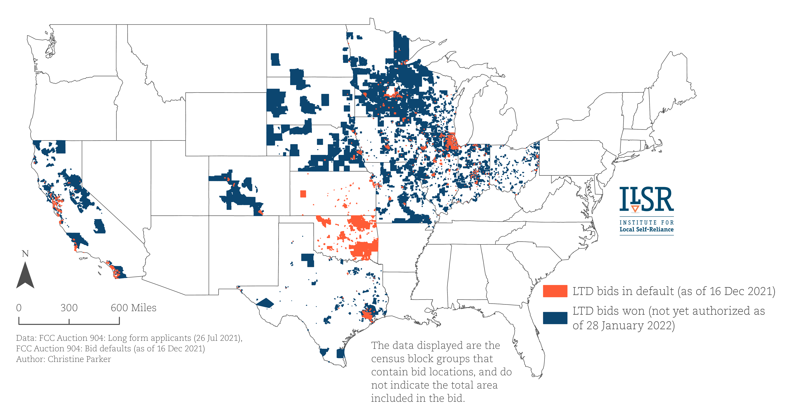
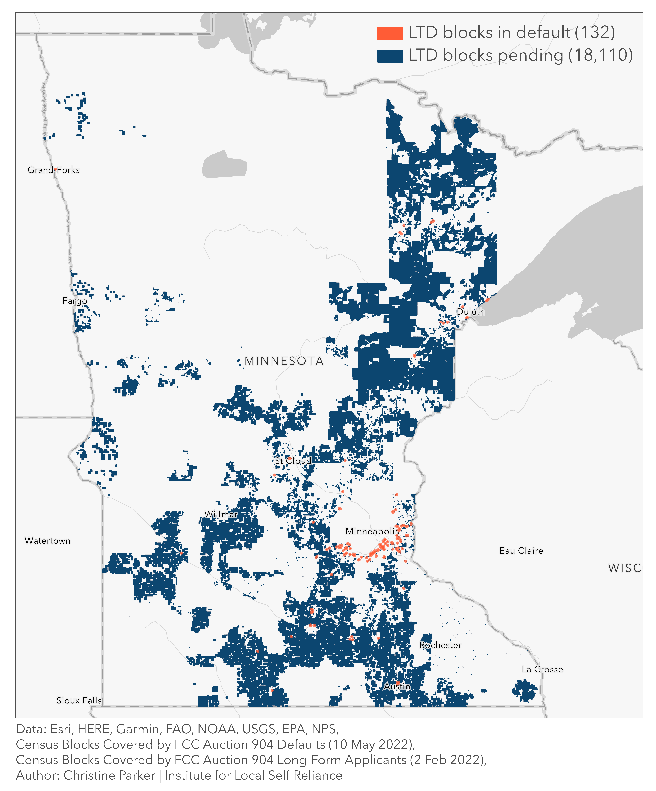

## Pattern

::::: grid
::: g-col-6
Map of bids won and defaulted on by a specific Internet service provider in a federal infrastructure program auction.
:::

::: g-col-6
{fig-alt="A static map of bids won/pending and defaulted across the United States by LTD Broadband, LLC in the Rural Digital Opportunity Fund auction." fig-align="center"}
:::
:::::

## Request

::::: grid
::: g-col-6
Following the completion of the FCC's Rural Digital Opportunity Fund auction, there were often questions about which Internet service providers defaulted on their awarded bids. The name of one provider in particular repeatedly surfaced in emails and requests, LTD Broadband, LLC. Fig. 1 and Fig. 2 represent two separate requests for static maps of where LTD defaulted on bids.
:::

::: g-col-6
{fig-align="right" width="357"}
:::
:::::

## Data Used

Data for these maps came from the [Auction 904 page on the FCC's website](https://www.fcc.gov/auction/904#two), under the 'Results' tab. LTD's defaults all occurred prior to authorization[^1], so the 'Pre-auth Census Blocks' tab of the file 'Census Blocks Covered by Auction 904 Defaults and Deduplication' were used to determine the census blocks where the defaults occurred. The file 'Census Blocks Covered by FCC Auction 904 Long-Form Applicants' includes the tab 'Census Blocks', which was used to define the census blocks in which bids were won by LTD. The [US Census Blocks National Geodatabase](https://www.census.gov/geographies/mapping-files/time-series/geo/tiger-geodatabase-file.2020.html#form-dropdown-1258746043) was used to display the focal areas in the map.

[^1]: Provider authorization was given following approval of the second application submission, which documented qualifications, funding, and infrastructure; included a letter of credit from an eligible bank; and included documentation of their certification of eligibility as telecommunications carriers in any area where they sought support.

## Method

These two lists of census blocks (i.e., won in auction/pending authorization and defaults) were used to select the specific blocks within the [US Census Blocks National Geodatabase](https://www.census.gov/geographies/mapping-files/time-series/geo/tiger-geodatabase-file.2020.html#form-dropdown-1258746043) to display in the map.

## Finding

Ultimately, LTD defaulted in all 15 states where it won bids to deploy Internet access in rural areas. These areas included 528,088 locations (estimated by FCC), and over \$1.3M in funds that could have gone to providers that were genuinely interested and able to get folks connected. LTD was not the only provider to default on its bids, and certainly not the worst. Space Exploration Technologies Corp. (otherwise known as Starlink) defaulted on 1.5M locations, amounting to \$2.2M, across 35 states. If you're interested, [you can read more here](https://communitynetworks.org/content/fcc-rejects-broader-relief-growing-list-rdof-defaulters) about how this problem continues to prevent folks from getting connected.
