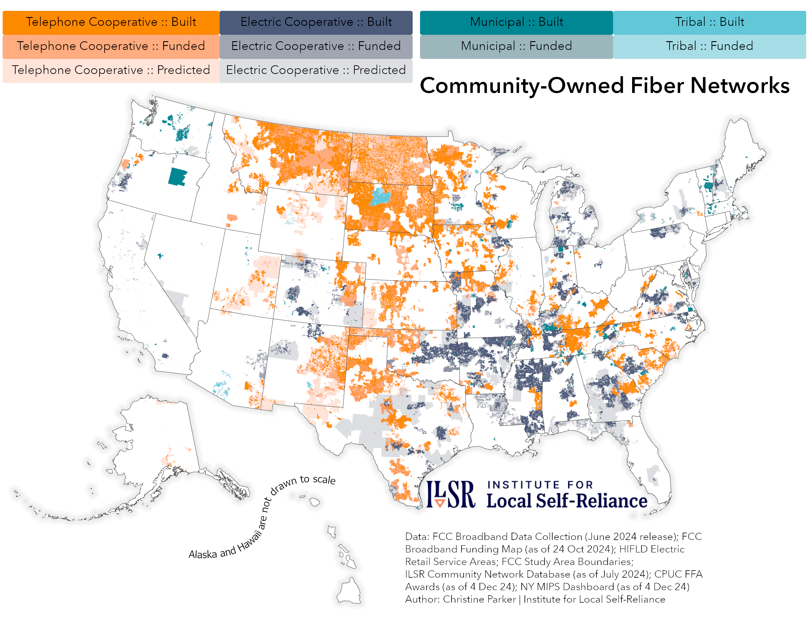
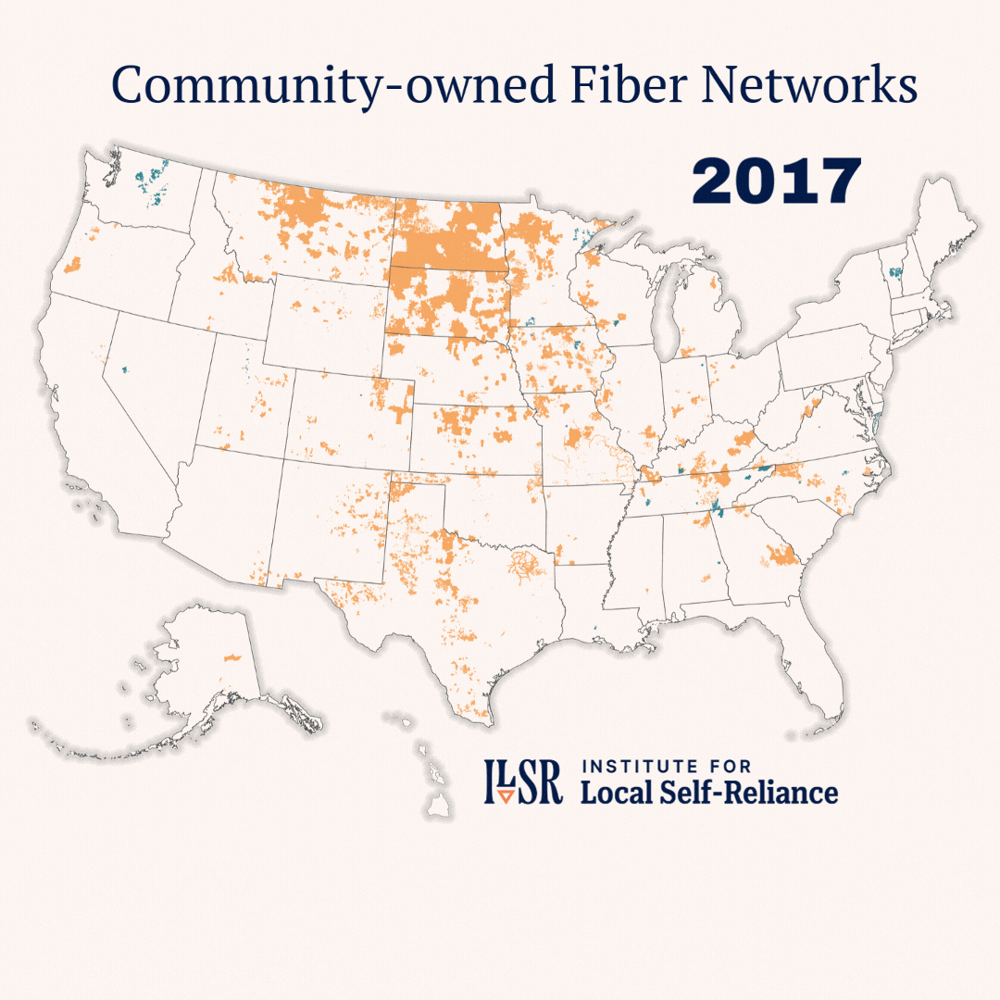

## Pattern

::::: grid
::: g-col-6
Map of community-owned fiber infrastructure - where it is, will be, and could be.
:::

::: g-col-6
[{fig-alt="A static map of where cooperative and municipally owned networks operate existing fiber networks, have received funding to build/expand networks, and where those networks could expand further." fig-align="right"}](https://communitynets.org/content/new-resource-alert-ilsr-unveils-community-networks-predictive-map)
:::
:::::

## Request

::::: grid
::: g-col-6
The aim of this map is threefold: 1) show how widespread community-owned fiber networks already are; 2) show where current fiber networks will be expanding; 3) show where current fiber networks could be developed in the future.
:::

::: g-col-6
{fig-alt="GIF shows a timelapse of community-owned fiber network growth from 2017-2023." fig-align="left"}
:::
:::::

## Data Used

These maps are derived primarily from the [FCC's Broadband Data Collection](https://broadbandmap.fcc.gov/data-download/nationwide-data?version=dec2025&pubDataVer=dec2025) (BDC) and [Broadband Funding Map](https://fundingmap.fcc.gov/data-download/funding-data), and ILSR's internal database of community owned networks. Other datasets used include [Electric Retail Service Areas](https://www.arcgis.com/home/item.html?id=597555ce8e4a4892a030784a7c657fdd#overview) (previously hosted publicly by HIFLD); [FCC Study Area Boundaries](https://www.fcc.gov/reports-research/maps/study-area-boundaries/); [CPUC FFA Awards data](https://www.cpuc.ca.gov/industries-and-topics/internet-and-phone/broadband-implementation-for-california/last-mile-federal-funding-account/federal-funding-account-awards); and data from the [NYS MIPS Dashboard](https://nysesd.maps.arcgis.com/apps/dashboards/d101f7f1804247018ea75e3aa2f91120#). The [US Census Blocks National Geodatabase](https://www.census.gov/geographies/mapping-files/time-series/geo/tiger-geodatabase-file.2020.html#form-dropdown-1258746043) was used to display the focal areas in the map.

## Method

ILSR's community network list is updated at least once a year by researching new fiber providers that appear in the BDC. The provider id number and frn[^1] were used to select all the locations claimed by those providers from the BDC. The BDC data are then aggregated to unique census blocks where each provider offers service, and those blocks represent the "built" layer of community fiber networks in the map. The funded layer is constructed in a similar fashion, but uses data from the Broadband Funding Map and ultimately shows where community networks have received federal funding to build/expand fiber networks. Data from New York State and California were also added to the funding layer, as the programs specifically supported the development of community networks. The final layer of the map represents where we expect to see future expansion of fiber networks. Unfortunately, the electric retail service areas and FCC study area boundaries are not so easily joined and filtered. A step wise process of fuzzy matching on provider names and manual selection occurs to create this final layer.

[^1]: An FRN, or FCC registration number, is a 10-digit number that is assigned to a business or individual registering with the FCC. This unique FRN is used to identify the registrant's business dealings with the FCC.

## Finding

The [development and growth of community fiber networks](https://communitynets.org/content/new-resource-alert-ilsr-unveils-community-networks-predictive-map) over the past decade is huge, and shows no signs of slowing. The availability of these networks provides many communities with affordable and reliable Internet service. In some areas passed over by monopoly ISP's, these networks may provide the only option for residents. In other areas, these networks may provide a new option for residents, where previously the option(s) may have been unreliable and/or unaffordable.
