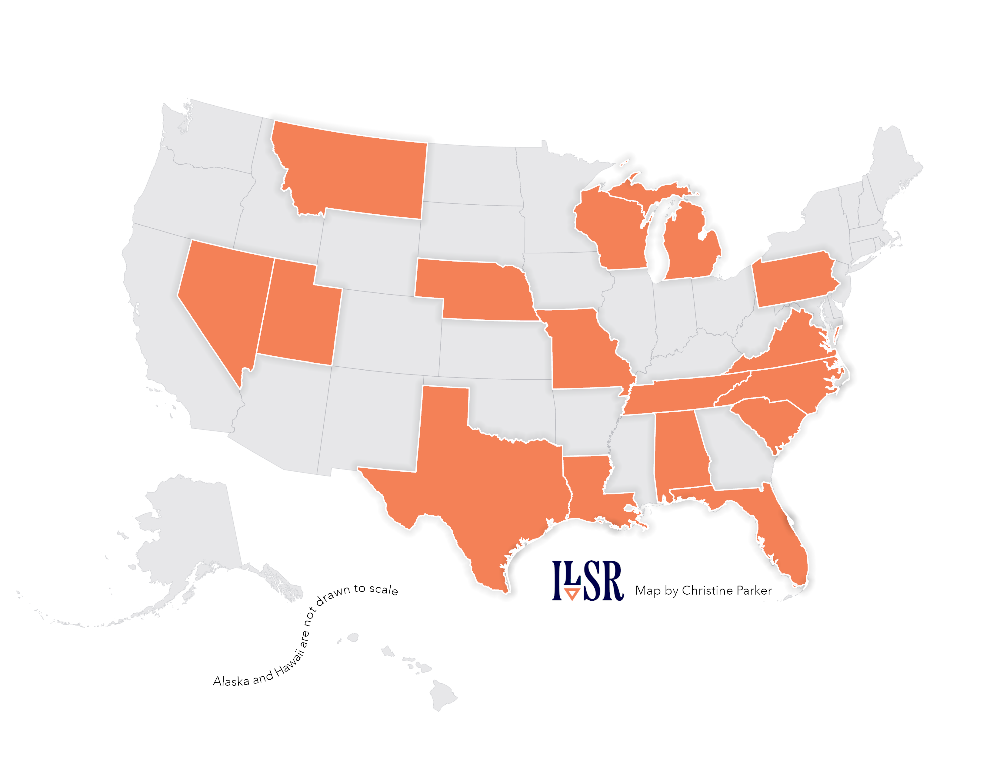

[{alt="States with preemption laws limiting community networks." fig-alt="The image shows a map of 50 United States, with 16 of those states colored orange. The 16 states include: Alabama, Florida, Louisiana, Michigan, Missouri, Montana, Nebraska, Nevada, North Carolina, Pennsylvania, South Carolina, Tennessee, Texas, Utah, Virginia, and Wisconsin." fig-align="center" width="462"}](https://communitynetworks.org/content/state-state-preemption-stalled-moving-more-competitive-direction)

## Pattern

The spatial extent of of some legislation.

## Request

A map showing the states that still have preemption laws that serve as barriers to community network development/operations.

## Data Used

ILSR's list of preemption states

## Method

Symbolized the states with existing preemption laws, and added drop-shadow to add emphasis.

## Finding

As of 1 Nov 2024, 16 states still had preemption laws in place that either strictly prohibit or present major barriers to building and operating community-owned, locally controlled broadband networks.

