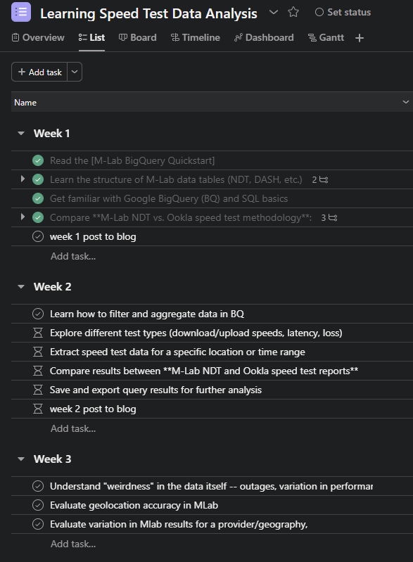

Welcome! This is the first post in this blog and beginning of this journey.

{fig-alt="Screenshot of a weekly tasks in an Asana project that are part of a learning plan to better understand and work with speed test data." width="405"}

## Why am I blogging?

I have a couple goals I'm hoping to achieve through this blog. The first is to expand my understanding and abilities to use R-based tools, like Quarto (check!). The second is to better understand and learn to analyze speed test data.

Of course I could do these things without publicly sharing, but quite frankly, "learn to use speed test data" has been a work goal since I started this job. Just the notion that this will be public has already prompted me to get started.

## What will I blog about?

As I get started with this blog, my plan is to initially focus on what I learn about speed test data - how it's collected, types of tests, data structure, test & data comparisons, and some practice analyses. I can also see this as a place to dig into my understanding of the FCC's Broadband Data Collection.

## When will I blog?

Since this is my first venture into blogging, I'm starting with a weekly post. As time allows I may post more frequently and may also invite friends over for an occasional guest post.
