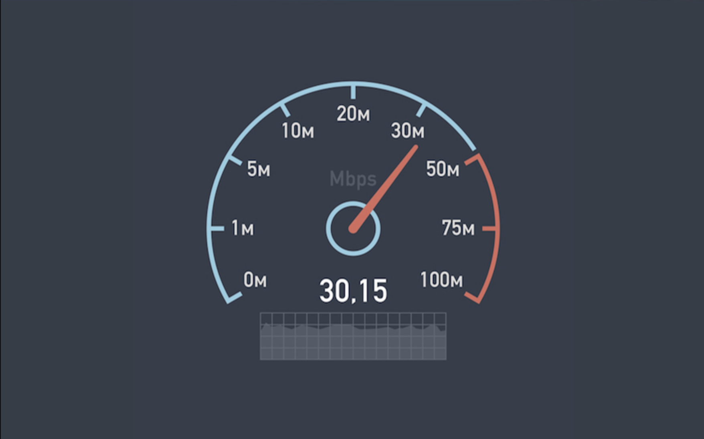

## Let's start at the very beginning

::::: grid
::: g-col-6
This week I skimmed through some articles about the different types of speed tests and dove right into running queries of test data. Then, as I sat down to write this, I realized I needed to rewind a bit and start with some basics. So here I present to you the 5 W's of speed tests (who, what, when, where, and why). Any mistakes in here are my own.
:::

::: g-col-6
{fig-alt="A speed gauge that starts at 0 Megabits per second and goes up to 100 Megabits per second. The gauge is indicating a speed of 30.15 Megabits per second." fig-align="right"}
:::
:::::

## Who

Typically, a speed test starts with **a person who is using the Internet** and due to \[insert a multitude of reasons\] wants to know about the speed of their connection. The person navigates to a speed test website and runs the test. Did you know that several test options exist? When I started working in this space in 2021, I sure didn't.

The tests are developed and maintained by different **organizations who collect and maintain databases of the test data.** These data are able to be accessed and used by anyone interested in better understanding Internet connectivity and performance, which might include **researchers, policy makers, advocacy groups, regulators, and the general public.**

## What

According to [Ookla](https://www.speedtest.net/about/knowledge/faq) a, "speed test measures the speed between your device and a test server, using your device's connection." While this a straight forward answer that I think most folks can understand conceptually, it doesn't quite capture the complexity of what a speed test is doing. While many of the metrics collected by different speed tests *seem* the same (e.g., download/upload speeds), the method by which those metrics are collected during a test can be pretty different.

For example, imagine the Internet is a big network of water pipes and we're going to use some speed tests to measure how well the water is flowing through the pipes.

::::: grid
::: g-col-6
First we want know how fast we can fill up the the pool. In this analogy, Ookla's Speedtest®️ will measure how much water can be delivered with the hose on full blast. This test can provide insight to the maximum capacity of the network, but perhaps is not best suited for accuracy in real-world conditions.
:::

::: g-col-6
[{fig-alt="A man is standing in the shallow area of an in-ground pool and holding a fire-hose that is spraying water at full blast into the pool." fig-align="left"}](https://www.flickr.com/photos/nix-pix/1441534196/)
:::
:::::

Next we want to know how much water we actually get when we're using the hose for normal tasks, like watering the garden. In this analogy, Measurement Lab's NDT (Network Diagnostic Tool) will measure how effectively the water is being delivered during normal water use. So this test can help evaluate for leakage or flow issues.

While there are additional speed tests out there, I'm going to stick to comparisons between Ookla and Measurement Lab (M-Lab for short) data sets. These seem to be (to me) the most frequently used data sets, and folks who's work includes the topic of "Internet access" have likely heard of one of these.

## When

If you've ever take a speed test, take a second to remember what prompted you to take it. Maybe you were watching a sports ball game or the newest episode of Bridgerton when it began stopping frequently to buffer. You might've wondered if you had an issue with your connection. I would wager that there is a bias regarding *when* speed tests from individuals occur, because when your connection is good, you probably don't give a thought to what a speed test would say about it. So these tests driven by a negative experience are probably common.

The Federal Communications Commission (FCC) also conducts speed testing ([until 2023](https://www.fcc.gov/general/measuring-broadband-america-measuring-fixed-broadband)) to evaluate the performance of Internet Service Providers across the United States. The FCC and other federal and state agencies may also require speed testing to monitor the performance of network infrastructure built using public funds.

## Where

Speed tests are available to use in your Internet browser, and more recently, browser-extensions and apps became available to run a speed test. These can be run on cell phones, tablets, laptops, desktops, etc...

While the test might be initiated by you on your device, where is the "test" operating? The short answer is...it depends. Remember that there are different types of tests?

While all speed tests operate over the network between the user's device and server, the test server location being used is determined by the test itself. M-Lab's NDT uses a single server that is geographically closest to the user and located "off-net", or the middle-mile portion of the network. Ookla's Speedtest®️ servers are located "on-net", or the last-mile portion of the network, and tests are directed and spread among servers with the least latency.

## Why

I mentioned earlier why you might want to take a speed test - to know if your connection is the reason your Netflix binge was interrupted. If the connection seems fine, you can move on to troubleshooting your device or WiFi hardware. Testing might also be required to ensure infrastructure is meeting some standard.

Another reason for speed tests, and the primary motivation for me learning more about them, is to enable researchers to evaluate the performance of the infrastructure of the Internet (i.e., "the pipes"). With those data in hand, we can learn about the performance of a connection as a function of the technology used to provide it (e.g., fiber, cable, DSL, fixed wireless), the Internet Service Provider (ISP) that providers the connection, and even the geography.
