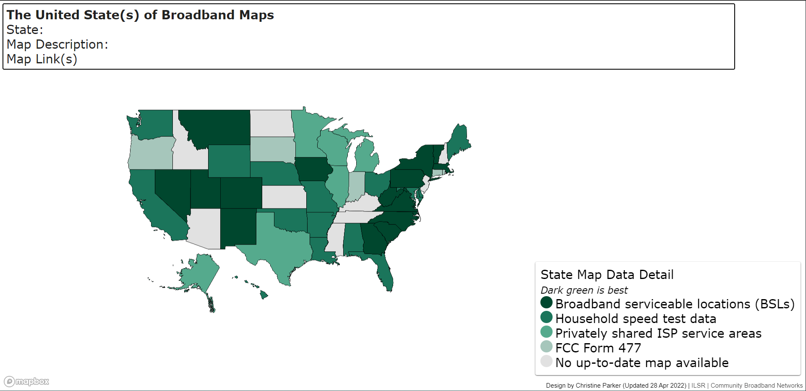

## Pattern

::::: grid
::: g-col-6
Interactive map of variation by state.
:::

::: g-col-6
[{fig-alt="An interactive map of the USA that indicates the type of data being used to create state-level broadband maps. Darker greens indicate more detailed data was used." fig-align="right"}](https://apps.communitynets.org/usbroadbandmap/)
:::
:::::

## Request

This map was [developed as a resource](https://communitynetworks.org/content/united-states-broadband) for me (and others) to keep track of the different approaches being taken by states to develop state-level broadband maps. When this map was created, states were developing these maps in advance of the FCC's initial release of the [Fabric](https://help.bdc.fcc.gov/hc/en-us/articles/5375384069659-What-is-the-Location-Fabric)-driven [National Broadband Map](https://broadbandmap.fcc.gov/home?version=dec2025) and to prepare for participation in the Broadband Equity Access and Deployment (BEAD) Program.

## Data Used

Data descriptions/sources described in state broadband maps. These data do not necessarily represent the status of state broadband maps when their respective challenge processes began, rather this work represents a snapshot in time.

## Method

Each state's primary data source for their respective broadband map recorded, and those categories summarized into the 5 groups shown in the map legend. A brief description of the map, data vintage, and map URL are included in the pop-up which fills in when the user clicks on a state.

## Finding

It appears that among states that used location-level data to develop their pre-BEAD broadband maps, the challenge period took 30 days. There was variation in challenge period lengths among states that built maps around speed test campaigns, privately shared ISP data, or Form 477 data. This doesn't indicate whether those challenge processes were more or less successful, but suggests that perhaps the preparation to work with more granular data may have been helpful.

```{r graphic, echo=FALSE}
library(ggplot2)
library(ggdist)
library(ggbeeswarm)

# read in data
df <- read.csv("graph_data.csv")

# Ensure rank is treated as an ordered factor
df$rank <- factor(
  df$rank,
  levels = c("1", "2", "4", "5", "6")
)

df$rank_pos <- c(
  "1" = 1,
  "2" = 3,
  "4" = 5,
  "5" = 7,
  "6" = 9
)[as.character(df$rank)]

ggplot(
  df,
  aes(
    x = length,
    y = rank_pos,
    fill = rank,
    color = rank
  )
) +

  # Rain cloud density
 stat_halfeye(
  adjust = 0.7,
  width = 0.5,
  justification = 0.1,
  .width = 0,
  point_colour = NA,
  alpha = 0.9
) +

  # Individual observations
geom_quasirandom(
  aes(
    x = length,
    y = rank_pos - 0.35,
    fill = rank
  ),
  shape = 21,
  color = "black",
  stroke = 0.2,
  alpha = 0.7,
  size = 2,
  #groupOnX = TRUE,
  orientation = "x"
) +

  # # Boxplot
  # geom_boxplot(
  #   width = 0.12,
  #   outlier.shape = NA,
  #   alpha = 0.6
  # ) +
  # scale_y_discrete(
  #   expand = expansion(add = 1)
  # )+ 

  scale_fill_manual(
    values = c(
      "1" = "#00482f",
      "2" = "#1b755b",
      "4" = "#55aa8d",
      "5" = "#a6c6bb",
      "6" = "#E1E1E1"
    )
  ) +

  labs(
    x = "Length of Challenge Period (# days)",
    y = "Map Rank",
    title = "Length of Challenge Period by Map Rank"
  ) +
  scale_y_continuous(
  breaks = c(1, 3, 5, 7, 9),
  labels = c("1", "2", "4", "5", "6")
)+

  theme_minimal(base_size = 15) +

  theme(
    legend.position = "none",
    panel.grid.minor = element_blank(),
    panel.grid.major.y = element_blank()
  )
```
