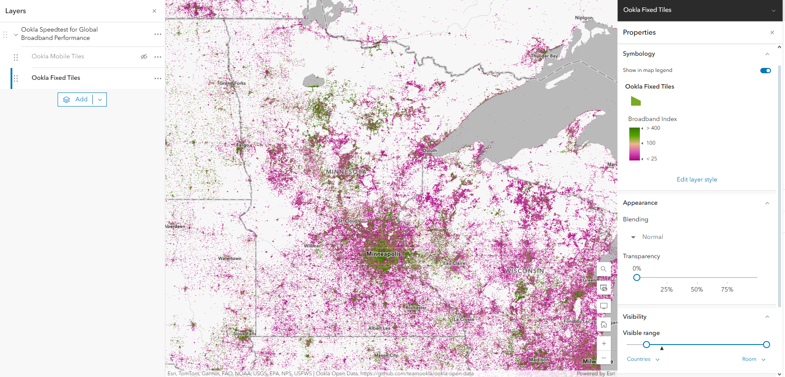
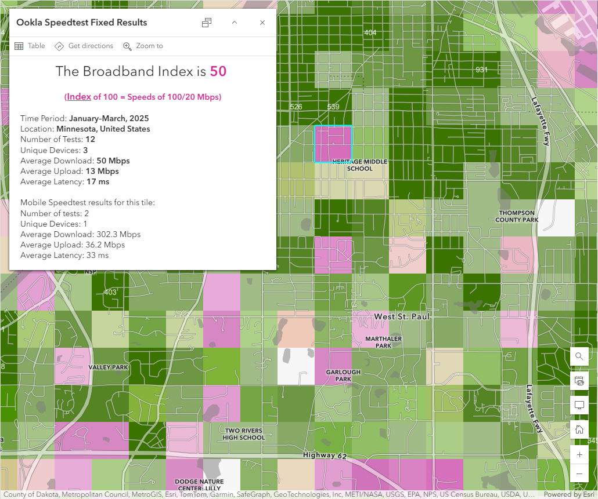

## What is easy to access and free to use?

Lacking any sort of clear pathway to learn about speed test data and their analysis, I decided to start by messing around with a dataset that is already packaged up for use. [Ookla Open Data are hosted by ESRI](https://services.arcgis.com/jIL9msH9OI208GCb/arcgis/rest/services/Speedtest_by_Ookla_Global_Fixed_and_Mobile_Network_Performance_Map_Tiles/FeatureServer) in tile format. The source data used to generate these tiles can be accessed directly via [Ookla's GitHub page](https://github.com/teamookla/ookla-open-data).

[{fig-alt="Map of Minnesota and neighboring states with the Ookla Fixed Tiles layer displayed. The Ookla Fixed Tiles layer is illustrated as squares ranging in color from magenta to green, with magenta indicating low broadband index values and green indicating higher broadband index values." fig-align="center"}](https://arcg.is/0nvziv)

Admittedly, I didn't find this dataset to be the easiest to interpret because of the lack of granularity, but I think it's a good starting point. With the data in a mapped format, I'm able to click around and explore the data having done nothing more than add the layer to a map. Once zoomed in, I'm able to get a clearer picture of where tests are occurring. Although, understanding connection performance is less clear to me with this dataset.

{fig-alt="A pop-up window is displayed on top of the map next to a pink tile that is highlighted in bright teal. The pop-up window lists different metrics about the tests taken within highlighted tile, including: time period, location, number of tests, unique devices, average download, average upload, and average latency." fig-align="left"}

## Ookla Open Data

I'm a sucker for a free dataset but I want this one to be more useful. As you can see in the pop-up, you get lots of information about a given tile. However, these aggregated measures are just that - data summaries for a small geographic square. Along with test metadata (i.e., timing, location, number of tests, and number of devices), users are provided averages of download, upload, and latency.

With these data I can also evaluate change in performance over time. Even though the ESRI-hosted tile sets inlcude only the most recent data available for a given tile, specific year-quarter datasets are available. Instructions to access those files are found [here](#0).

The question of which ISP is under performing is not something you'll be able to address using this dataset. To track down ISP-specific data related to these tests, you'd need to get a subscription with Ookla. Since a subscription to Ookla is out of my price range, I'll be working with the NDT dataset from Measurement Lab.

*Ultimately, I think this dataset is a good starting point for understanding where and when connectivity problems have occurred, but not much more than that.*
